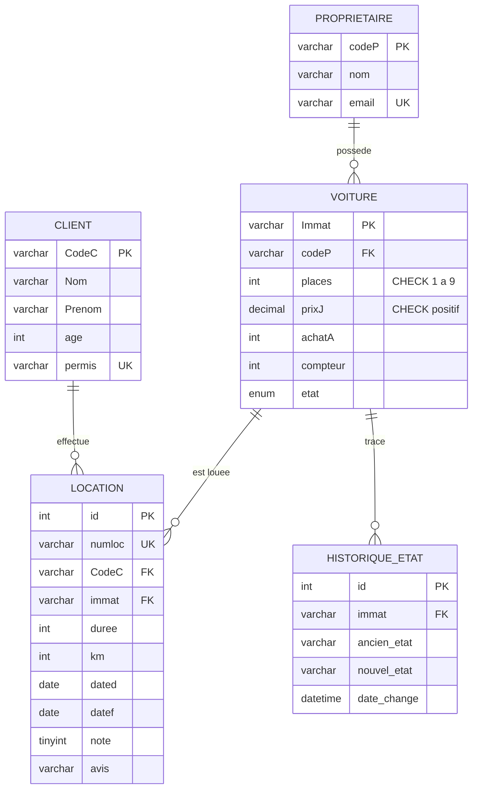
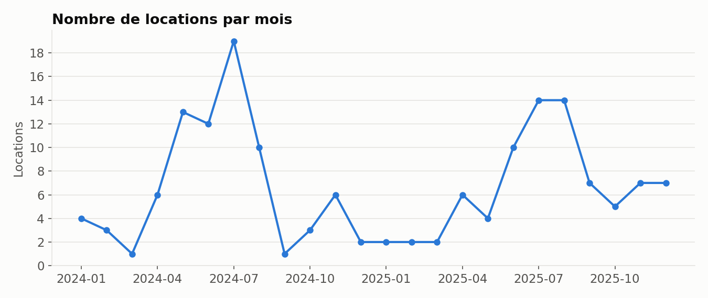
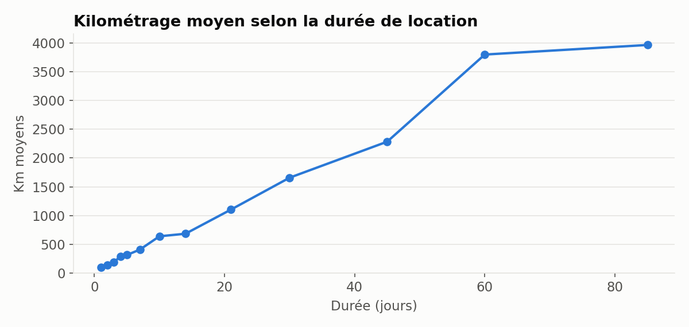
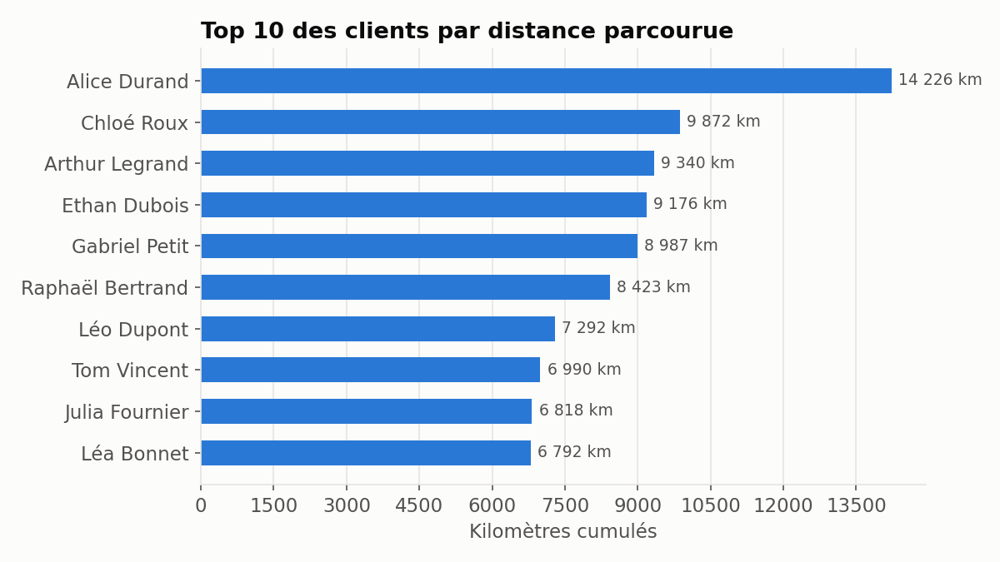
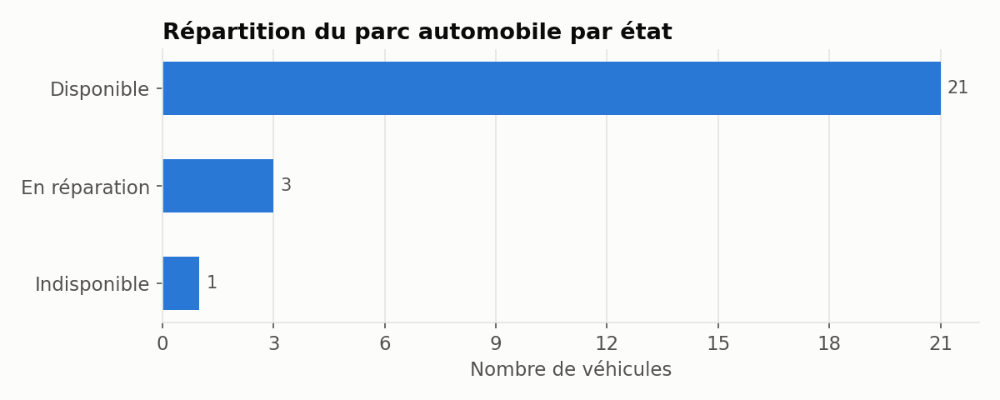
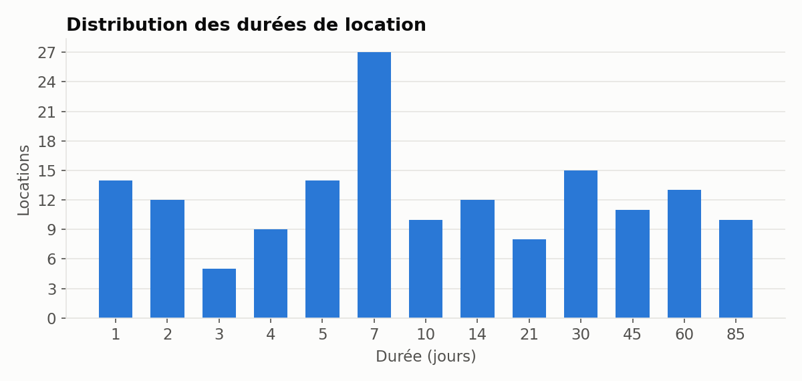

# Agence de location de voitures — base de données avancée (MySQL)

Projet de **base de données avancée** réalisé en binôme (Édouard Menut & Chloé Lestic) à l'ECE Paris, 2025/2026.

À partir de fichiers CSV bruts d'une agence de location, on construit une base **propre, contrainte et sécurisée**, puis on l'enrichit avec des vues, des droits d'accès, de la gestion de transactions, des procédures stockées, des triggers et des analyses.

Ce dépôt rejoue tout le projet **en une commande**, sur un jeu de données fictif.

## Démarrage rapide

```bash
docker compose up -d                                       # crée et remplit la base (scripts 00 → 07)
docker compose exec db mysql -uroot -proot agence_location # ouvre un terminal SQL
```

```sql
CALL analyse_client('C654');
SELECT * FROM V_client ORDER BY distance DESC LIMIT 5;
SELECT * FROM historique_etat;
```

Pour régénérer les graphiques :

```bash
pip install -r analyses/requirements.txt
python analyses/graphiques.py
```

## Modèle de données



## Contenu

| Étape | Script | Ce qui est fait |
|---|---|---|
| Données brutes | [`00_schema_brut.sql`](sql/00_schema_brut.sql), [`01_donnees_brutes.sql`](sql/01_donnees_brutes.sql) | Tables telles qu'après un import CSV : dates en texte, aucune clé, doublons |
| Nettoyage & intégrité | [`02_nettoyage_contraintes.sql`](sql/02_nettoyage_contraintes.sql) | Typage des dates, dates de fin manquantes ou incohérentes, dédoublonnage des e-mails et des permis, clés primaires et étrangères (`ON UPDATE CASCADE`, `ON DELETE SET NULL`), contraintes `CHECK` |
| Vues | [`03_vues.sql`](sql/03_vues.sql) | Distance par client (`LEFT JOIN` + agrégat → vue non modifiable), clients de plus de 55 ans, variante `WITH CHECK OPTION` |
| Droits d'accès | [`04_droits_acces.sql`](sql/04_droits_acces.sql) | Table applicative `ACCESS` remplie automatiquement, trois utilisateurs MySQL (lecteur, éditeur, admin avec `GRANT OPTION`) |
| Procédures stockées | [`05_procedures.sql`](sql/05_procedures.sql) | Note de 1 à 5 par location, avis textuel, synthèse par client |
| Triggers | [`06_triggers.sql`](sql/06_triggers.sql) | Une voiture ne peut être louée que si elle est disponible, retour automatique à « Disponible » en fin de location, historique de chaque changement d'état |
| Analyses | [`07_analyses.sql`](sql/07_analyses.sql), [`graphiques.py`](analyses/graphiques.py) | Requêtes d'analyse et graphiques |
| Démonstrations | [`demos/`](demos) | Vues modifiables ou non, droits par utilisateur, cycle de vie d'une voiture, **accès concurrents** (mise à jour perdue, lecture sale, `SELECT … FOR UPDATE`) |

## Points intéressants

- **Mise à jour perdue** : deux sessions qui lisent puis écrivent le même compteur kilométrique s'écrasent. Verrouiller la ligne dès la lecture (`SELECT … FOR UPDATE`) et écrire de façon relative (`compteur = compteur + 100`) règle le problème → [`demos/concurrence`](demos/concurrence/README.md).
- **MyISAM vs InnoDB** : la table était d'abord en MyISAM, un moteur sans transactions. Le passage à InnoDB a rendu possibles `ROLLBACK`, les verrous de ligne et les niveaux d'isolation.
- **Erreur 1093** : une mise à jour d'une table qui se sous-interroge elle-même est refusée par MySQL. Le dédoublonnage passe par une jointure sur une sous-requête agrégée, qui est matérialisée.
- **Triggers en chaîne** : une nouvelle location modifie l'état de la voiture, ce qui alimente automatiquement l'historique.
- **Limite assumée** : les mots de passe de la table `ACCESS` sont un `MD5` de données connues, ce qui n'est pas sûr. En production, il faudrait un mot de passe aléatoire et un hash lent et salé (bcrypt, Argon2).

## Analyses





<details>
<summary>Autres graphiques</summary>





</details>

> Les données sont **fictives**, générées par [`scripts/generer_donnees.py`](scripts/generer_donnees.py) avec des défauts volontaires (dates manquantes, doublons) pour rejouer le nettoyage. Les graphiques ne décrivent donc pas une vraie agence.

## Technologies

MySQL 8 (InnoDB) · SQL avancé (vues, procédures stockées, triggers, transactions) · Docker Compose · Python (PyMySQL, Matplotlib)

Dans le projet d'origine, une application **Python / Tkinter** permettait aussi de faire les opérations CRUD et d'afficher ces graphiques. Elle n'est pas incluse ici.
